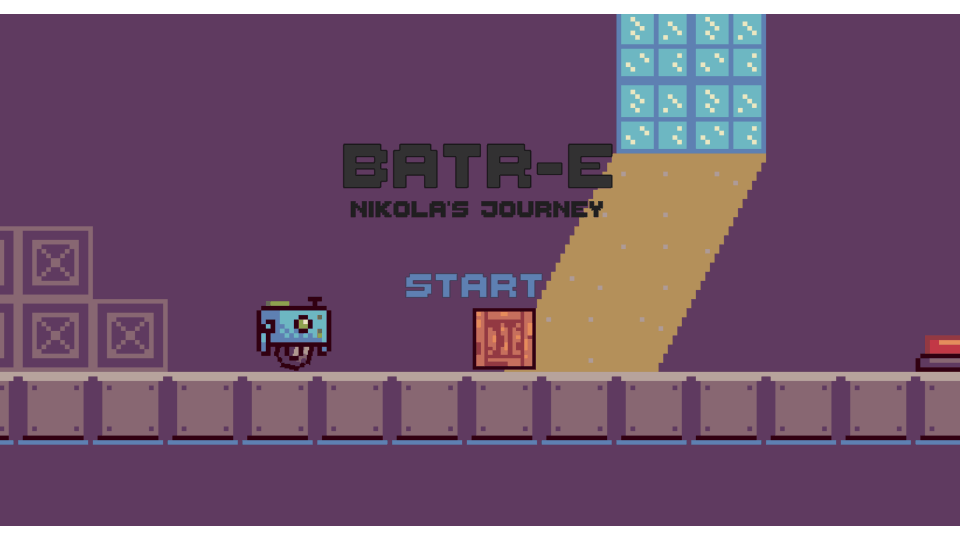
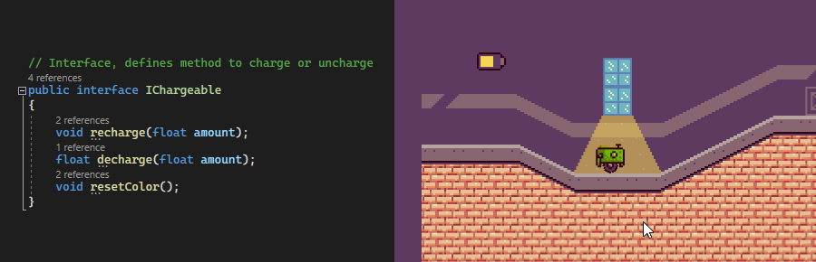
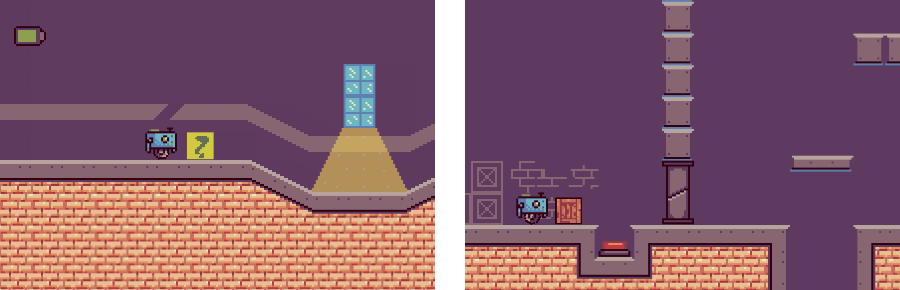
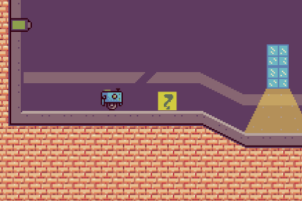
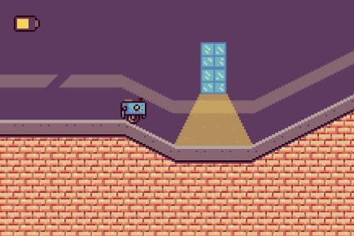
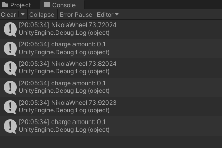
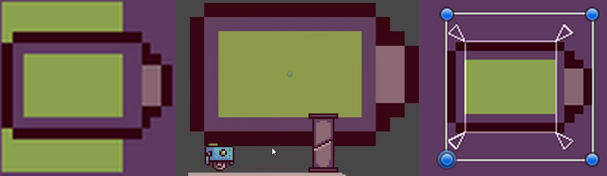
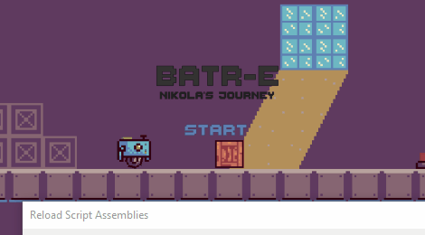

# Batr-E - Nikola's Journey

## Idea

In the distant Solarpunk future, a small repair robot named Nikola is assigned to rebuild an old factory. There are no enemies, the environment and it's puzzles are "the enemy" - giving PvE a deeper meaning.

# My Contributions

- ## Recharge Interface

    I created a small interface through that each object, that needed to be recharged or uncharged can influence each other just by implementing it. That way, everything would be extensible and a bit more independent and future-proof.

    Here the light implements it to charge the robot, while the robot implements it to get charged by it (or charge other things by touch).
    

- ## Create Puzzle Objects
    I had to come up with pther objects we'd use to cinstruct puzzles. As everything would revolve around energy and we wanted to start small, I came up with: a simple wooden box, a weight sensitive switch, an energy box, an energy needing switch, doors connected to each such button and I even planned an elevetor (as our character couldn't jump or climb). Not all were implemented.
    

- ## Energy Transfer
    Sadly, this never got fully realized, but with everything before, the potential was there. Though touch or even certain actions, Nikola could communicate over the interface and influence the charge value of objects. (Note: The two gifs aren't tied directly, just visualize the same process differently.)
    

- ## Healing Animation
    Even though UI and Animation wasn't my task, I decided to add this little color change "animation" to the interface, so palyers get a vizual cue when charging. (Note: The two gifs aren't tied directly, just visualize the same process differently.)
    

- ## UI & Bug Fixes
    I also helped fix some weird UI bugs and any code related bug I could find. Finding and fixing errors is kinda my thing and I like it.
    

---

Forked from [U-Knights](https://github.com/U-Knights).

[See here](https://github.com/U-Knights/U-Knights/blob/main/Batr-E.md) for more information in German.